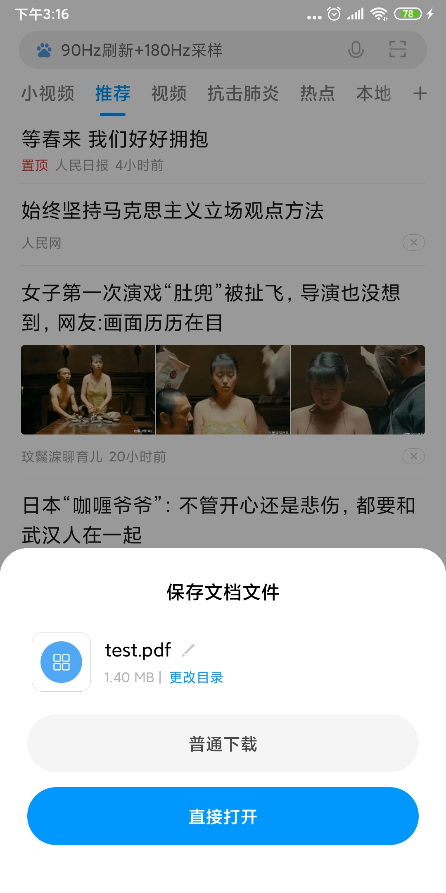

# EvaluationPDF
PDF Evaluation on Android (Android 平台上的 PDF 测评)


从多个纬度对 Android 的 PDF 加载做测评，重点考虑因素:

- 包体积增量大小
- 加载能力(远端、本地)
- 加载速度
- 易用性
- 是否支持 pdf 缩放


测试文件: 个人服务器上的 test.pdf  大小为 1.4MB

测评设备: Redmi note 5 / Android 9

测评方式: 以 master 分支上的分支为纯净分支，产生的空 apk 的大小为 2,706,998  字节(约2.7MB assets 包含 test.pdf) ，此后每测评一种新的支持 PDF 的能力都拉出一个新分支做代码接入以及计算包增量


## 方式1:外部浏览器打开

分支: browser 

apk 增量无

成本低

加载风险无 (每个手机都至少存在默认浏览器)

加载过程：

1、从当前 app 跳转浏览器应用

2、浏览器解析地址弹出选项是下载还是打开

3、浏览器



缺点: 打开之后需要回退栈几次才能回到原应用


```java
    public static void openPDFInBrowser(Context context, String url) {
        Uri uri = Uri.parse(url);
        Intent intent = new Intent(Intent.ACTION_VIEW, uri);
        intent.putExtra(Browser.EXTRA_APPLICATION_ID, context.getPackageName());
        try {
            context.startActivity(intent);
        } catch (ActivityNotFoundException e) {
            Log.w("error", "Activity was not found for intent, " + intent.toString());
        }
    }

```

## 方式2 PDF.js Local 

实现方式基于webview 内嵌 pdf.js 

分支: pdf_js_local

apk 增量 约 4.9 MB 

成本低

加载无风险(加载本地 pdf ，远端 pdf 得先下载到本地再保存)


```java

    public static final String LOCAL_FILE = "file:///android_asset/test.pdf";

    WebView mWebView;

    @Override
    protected void onCreate(@Nullable Bundle savedInstanceState) {
        super.onCreate(savedInstanceState);
        setContentView(R.layout.activity_main);
        initView();

        mWebView.loadUrl("file:///android_asset/index.html?" + LOCAL_FILE);
    }

    @SuppressLint("SetJavaScriptEnabled")
    private void initView() {
        mWebView = findViewById(R.id.webView);

        WebSettings webSettings = mWebView.getSettings();
        webSettings.setJavaScriptEnabled(true);
        webSettings.setAllowFileAccess(true);
        webSettings.setAllowFileAccessFromFileURLs(true);
        webSettings.setAllowUniversalAccessFromFileURLs(true);
    }
```


优点: 应用内加载，加载速度较快

缺点: 

apk 增量不小，但比 AndroidPdfViewer 这点要强很多

目前调研不支持缩放: 已经设置 webview 相关 setSupportZoom 接口


## 淘汰方案:

1 github 开源库 

https://github.com/barteksc/AndroidPdfViewer 

淘汰原因，对 apk 增量过大，暂未实际测评网上查询资料是 15MB 


2 连接Google服务器解析

淘汰原因: 国内网络环境访问 Google 需要翻墙


3 PdfRenderer / PdfDocument

```java
android.graphics.pdf
```

Android 原生的 PDF 支持类库

淘汰原因: 

Android API > 21 才可用

编码成本不低

不支持在线 http 预览需要下载文件到本地